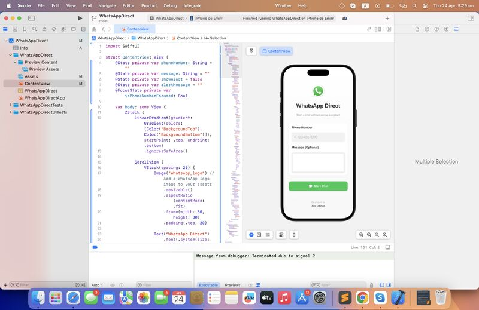

# 📱 WhatsApp Direct

A minimal iOS app built with **Swift** and **SwiftUI** that allows users to start a WhatsApp chat with any phone number — **without saving the contact**.

---

## ✨ Why I Built This

This idea came straight from my **daily routine frustrations**:  
I often need to message people just once — like delivery drivers, clients, or service providers — and I hated saving each number just to send a message.

So I built **WhatsApp Direct** to make that quick interaction as simple as possible.

---

## 📸 Screenshots

  

---

## 🚀 Features

- ✅ Enter a phone number (with country code)
- ✅ Optionally add a message
- ✅ Tap **Start Chat** to instantly open WhatsApp
- ✅ Simple, fast, no need to save contacts

---

## 🛠 Tech Stack

- `Swift`
- `SwiftUI`
- `Xcode`
- Manual `.ipa` export
- Installed via [AltStore](https://altstore.io/) (no paid Apple Dev account needed)

---

## 📦 How to Install (Without App Store)

1. Clone or download the project
2. Open `WhatsAppDirect.xcodeproj` in Xcode
3. Connect your iPhone via USB
4. Select your device as the build target
5. Run the app on your iPhone (`⌘ + R`)
6. To create an `.ipa`:
   - Build the app → find `.app` in `DerivedData`
   - Package it into `.ipa` using a `Payload` folder
   - Sideload it via **AltStore**

---

## 📍 Status

- ✅ First release working on real iPhone
- 🚧 Future features (maybe):
  - Dark mode
  - Country code picker
  - URL preview for messages

---

## 🙌 Acknowledgments

- Inspired by my **own daily needs**
- WhatsApp URL scheme: `https://wa.me/<number>`

---

## 💬 Connect

I really enjoyed building this little utility — and I hope you find it useful too.  
Feel free to connect with me on [LinkedIn](https://www.linkedin.com/) or share your thoughts!

---

## 📄 License

This project is open-source under the [MIT License](LICENSE).
